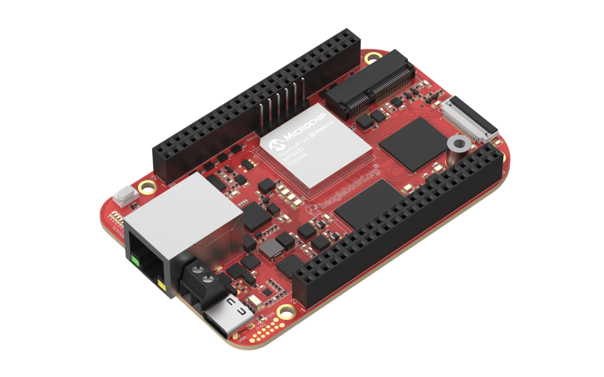

# BeagleV-Fire

BeagleV-Fire is single-board computer (SBC) powered by the Microchip’s PolarFire 5x core RISC-V System on Chip (SoC) with FPGA fabric. BeagleV-Fire opens up new horizons for developers, tinkerers, and the open-source community to explore the vast potential of RISC-V architecture and FPGA technology. It has the same P8 & P9 cape header pins as BeagleBone Black allowing you to stack your favourite BeagleBone cape on top to expand it’s capability. 

---

The Board has a very easy access, easiest of all beagleboards in my opinion. Its like a plug and play device. Just power the device using power adapter or connect the board to your host PC using USB-C cable. As the board boots you can access it using three methods:

1. Cockpit-Web Console
2. USB-UART 
3. SSH connections 

I tried all three of them and the board responded in first try.

I would highlight that all these steps can be used on the board directly out of the box, no need to flash a bootloader or linux image, everything is already set in the board’s EMMC.

Additional Information on the board can be found [here](https://docs.beagleboard.io/latest/boards/beaglev/fire/01-introduction.html).